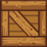

# GRA 
## Opis ogólny
__Motywacje do stworzenia projektu__
 
 Gra ta powstaje z powodu coraz to rosnącego zapotrzebowania na rozrywkę elektrocniczną. Starając się odpowiedzieć na popyt na tego typu media, zrobiliśmy co mogliśmy aby zapwnić możliwie jak najlepszą zabawę naszym odbiorcom
 
 
 __Kluczowe cechy__

  * Zróżnicowany otwarty świat
  * Ciekawi i wymagający przeciwnicy
  * Wielorakość zadań
 
 
 __Wymagania techniczne__
  * CODE::BLOCKS + sfml
  * 100mb pamięci wewnętrznej
  * 2gb pamięci RAM
  * Procesor
  
  ## Opis poszczególnych elemtów oprogramowania
  
  ### Klasy wykorzystywane w projekcie
   * Player _Klasa gracz. Pozwala na sprecyzowanie parametrów odpowiadających za sposób interakcji bohatera ze światem, takich jak wysokość skoku, zajmowany obszar i punky początkowy_
   * Platform _Dzięki tej klasie możemy tworzyć wiele elemntów tworzących podstawę mapy stworzonego świata. W samej klasie możemy zmienić rozmiar czy domyślną teksturę platformy_
   * Collecatable _Klasa określa wynik interakcji gracza z przedmiotem do zbierania_
   * Animation _Klasa mówi w jaki sposób wyświetlać tekstóry, aby tworzyły płynnne animacje_ 
   * Collider _Dzięki tej klasie każdy obiekt zna swoje położenie wzgędem graca i może odpowiednio reagować_
   * Enemy _Wtóg. Określa zakres jego ruchów czy zajmowanu obszar_
   * Box _Jest to kolejny przedmiot w którym możemy wchdozić w interakcję, poprzez jego przesównanie_
   * Tekst _Możemy wyświtalć wiadomościdla gracza_ 
   
Instancję każdej z powy.ższych klas, poza klasą player możemy wywołać wielokrotnie. Każdej z klas podajemy kordynaty początkowe w miejscu wywołania.

### Player
Tekstury:

__Funkcje__
   * update, _Reagowanie na instrukcje gracza i zmiana pozycji_
   * onCollisionWithEnemy._ W razie kolizji z wrogiem, strać życie_
   * draw, _renderuj: domyślny element SFML_
   * onCollision, _Wywołuję zdarzenie zetknięcia z obiektem, funkcje tę posiadają prawie wszystkie klasy_
   * onCollisionWithCoin, _W razie kolizji z Monetą do zbierania, dołóż do już zebranych_

  
  
  
### Enemy
Tekstury:

__Funkcje__

   * update, _synchronizuj wyświetlanie animacji z pozycją w logice gry_
   * killDragon, _dezaktywuje wroga po odpowiedniej akcji wykonanej przez gracza_

### BOX
Tekstury:

##  Dokumentacja biznesowo-realizacyjna projektu
__Pomysł:__

Stworzyć grę platformową 2d z elementami walki, fizyki i zbierania “znajdźiek”.

__Rozwiązywany problem:__

Lekka i przyjemna gra która będzie działać nawet na najsłabszym sprzęcie bez potrzeby poświęcania jakości.

__Potrzebny zespół:__

Programiści c++

__Kluczowe własności pomysłu:__

   * Szeroka grupa potencjalnych odbiorców
   * Wysoka wydajność
   * Zróżnicowanie stylów rozgrywki

__Nasza gra będzie dostępna za darmo__,ponieważ chcemy dotrzeć do wszystkich możliwych odbiorców, na licencji MIT

__Dystrybucja odbędzie się za pośrednictwem wyspecjalizowanych platform__ (jak “Steam”)

__Podstawowa funkcja aplikacji:__ 

Zapewnienie rozrywki odbiorcom poprzez możliwie jak najbardziej zróżnicowaną zawartość

__Przetwarzane dane:__

Aplikacja przyjmuje dane wprowadzane z klawiatury, użytkownik może sterować ruchami swojej postaci.

__Testowanie:__
   * Proces testowania w przypadku naszej produkcji miał dwa etapy. Pierwszy to testy poprawności implementacji funkcjonalności. 
   * Kompilowanie
   * Testy jednostkowe poszczególnych funkcji (inspekcja i porównywanie wyników wywołania z wynikami oczekiwanymi)
   * Testy rozgrywki, projektu mapy.
   * Każdy element został ułożony zgodnie z pierwotnym założeniem
   * Zostało sprawdzone czy rozkład elementów pozwala na ukończenie gry
Wprowadzono odpowiednie poprawki

